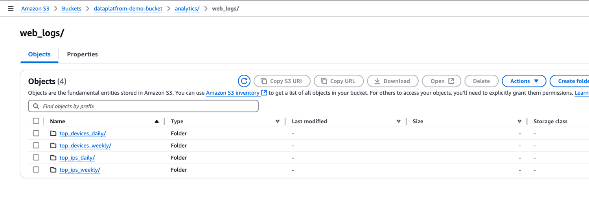
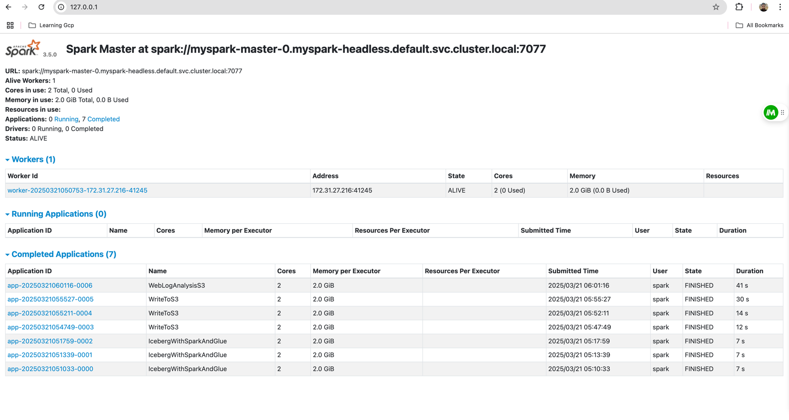

## AWS Spark Dataplatform

This project is designed to deploy a Spark cluster on AWS EKS (Elastic Kubernetes Service) with integration to AWS Glue Catalog and S3 for data storage. The infrastructure is managed using Terraform and the Spark configuration is defined in YAML files.

## Prerequisites

1. **AWS Account**: Ensure you have an AWS account with the necessary permissions to create IAM roles, EKS clusters, and other resources.
2. **AWS CLI**: Install and configure the AWS CLI with your credentials.
3. **Terraform**: Install Terraform to manage the infrastructure.
4. **kubectl**: Install `kubectl` to interact with the Kubernetes cluster.
5. **Helm**: Install Helm for managing Kubernetes applications.
6. **Python**: Ensure Python is installed for any additional scripting or application logic.
7. **AWS VPC**, Subnet, Security Group pre-created berfore running terraform script
## Setup Instructions
### 0. Install Required Tools
local should have aws account access, create a role in aws iam and attach the role to the local machine


### 1. Clone the Repository

```sh
git clone https://github.com/Vikas3soni/your-repo.git
cd your-repo
```

### 2. Configure AWS CLI

```sh
aws configure
```

### 3. Initialize and Apply Terraform Configuration

Navigate to the `infra/modules` directory and initialize Terraform:

```sh
cd infra/modules
terraform init
terraform plan
```

Apply the Terraform configuration to create the necessary AWS resources:

```sh
terraform apply -auto-approve
```
#### Note:
Terraform will create following resources-
1. EKS Cluster
2. EKS Node Group
3. EKS Node Group IAM Role
4. EKS Node Group Security Group
5. EKS Node Group Instance Profile

### 4. Deploy Spark on EKS

Navigate to the `infra/k8_configs` directory and apply the Kubernetes configurations:

spark_configs.yaml file contains the configuration for the spark cluster, you can modify the configuration as per your requirement
- currently its spark 3.5.0 version
- spark master and 3 worker nodes
- Machine configuration - t2.medium

```sh
aws eks update-kubeconfig --region <REGION> --name <CLUSTER-NAME> --profile <PROFILE-NAME>
cd ../k8_configs

brew install helm

helm repo add bitnami https://charts.bitnami.com/bitnami
helm install <SVC-NAME> bitnami/spark -f infra/k8_configs/spark_configs.yaml
```
## Port forward to access spark UI
```sh
sudo kubectl port-forward --namespace default svc/myspark-master-svc 80:80
```

### 5. Verify Deployment

Check the status of the EKS cluster and Spark pods:

```sh
kubectl get nodes
kubectl get pods -n spark
```

## Running Spark Jobs

To submit a Spark job, use the following command:

```sh
kubectl exec -it <spark-master-pod> -- /opt/bitnami/spark/bin/spark-submit --class <your-main-class> --master k8s://https://<your-eks-cluster-endpoint> <your-application-jar>

kubectl cp ./web_analytics_job.py default/myspark-worker-0:/tmp/web_analytics_job.py

#sample command
kubectl exec -ti --namespace default myspark-worker-0 -- spark-submit \
    --master spark://myspark-master-svc:7077 \
	 --conf spark.executor.memory=2g \
    --conf spark.driver.memory=2g \
    /tmp/web_analytics_job.py

```

Replace `<spark-master-pod>`, `<your-main-class>`, `<your-eks-cluster-endpoint>`, and `<your-application-jar>` with the appropriate values.

## Cleaning Up

To destroy the infrastructure and clean up resources, run the following command in the `infra/modules` directory:

```sh
terraform destroy
```

## Additional Information

- **IAM Policies**: The project includes IAM policies for accessing S3, DynamoDB, and Glue.
- **Spark Configuration**: The Spark configuration is defined in `spark_configs.yaml` and includes settings for AWS Glue Catalog and S3.
- **Terraform State**: The Terraform state files are ignored in the `.gitignore` to prevent sensitive information from being committed.

For more detailed information, refer to the individual configuration files and the official documentation of the tools and services used.

## Output
NOTE - Currently this project is not using hive metasotre, so the data is not stored in hive, but the data is stored in s3 bucket
Write the data to the bucket

### spark output


### spark job output
